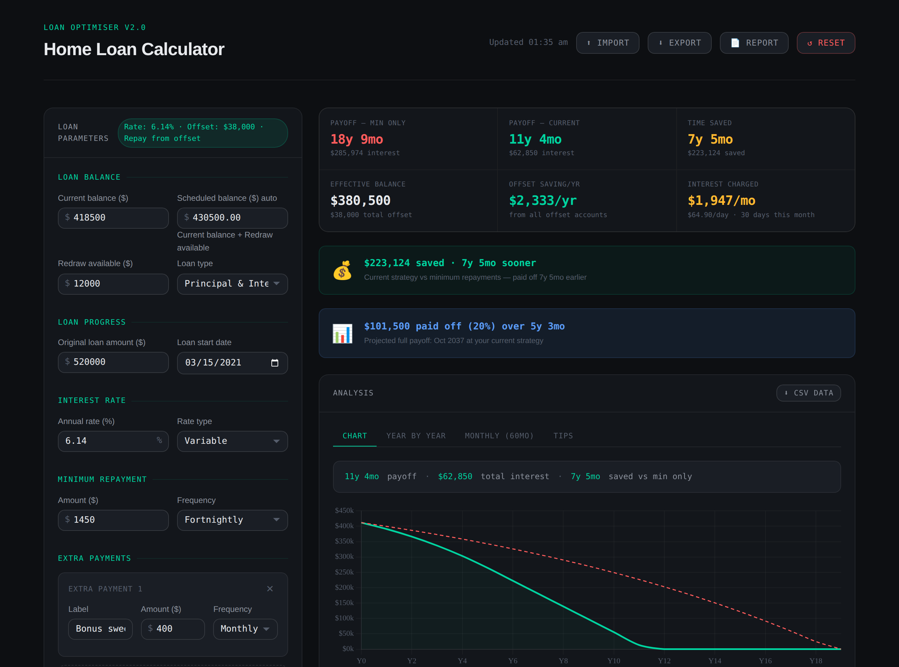

# 🏠 Home Loan Optimiser

A free, privacy-first home loan calculator that shows you exactly how much time and interest you can save by making extra repayments and using offset accounts — with no sign-up, no backend, and no data ever leaving your browser.


[](https://github.com/scottiedisaster/Home-Loan-Optimiser)



> 🇦🇺 Built with Australian mortgages in mind (offset accounts, fortnightly repayments, RBA rate commentary) but the maths works for any currency or country — just type in your own numbers.

## Table of contents

- [Why this exists](#why-this-exists)
- [Features](#features)
- [How to use it](#how-to-use-it)
- [Run it locally](#run-it-locally)
- [Project structure](#project-structure)
- [How the maths works (and where it's simplified)](#how-the-maths-works-and-where-its-simplified)
- [Privacy](#privacy)
- [Browser support](#browser-support)
- [Contributing](#contributing)
- [Credits](#credits)
- [License](#license)
- [Disclaimer](#disclaimer)

## Why this exists

Most "extra repayments calculators" online are lead-generation tools for mortgage brokers — they ask for your email before showing you a number. This one doesn't. It's a static set of HTML/CSS/JS files, runs entirely in your browser, has no analytics, no accounts, and isn't trying to sell you anything. Use it, fork it, host your own copy, change it — that's the point.

## Features

### 💰 Loan setup
- Current balance, redraw available, and an auto-calculated **scheduled balance** (balance + redraw)
- Annual interest rate, with Variable/Fixed and Principal & Interest/Interest Only labels for your own records
- Minimum repayment amount at weekly, fortnightly, or monthly frequency

### 📈 Loan progress tracking
- Enter your **original loan amount** and the **date you took out the loan**
- Instantly see how much (and what %) you've paid off so far, how long you've been paying it off, and a real **projected payoff month and year** — not just "X years from now"

### ➕ Extra repayments
- Add as many extra payments as you like, each as a recurring amount (monthly/fortnightly/weekly/yearly) or a one-off lump sum
- Model a bonus, tax refund, side-income, or a simple "$50 extra a week" and see exactly how much time and interest it saves

### 🏦 Offset accounts
- Add multiple offset accounts (e.g. bills buffer, emergency fund, salary account) with their own balance and recurring deposit
- Mark **one** account as the *repayment source* to accurately model salary cycling — where your minimum repayment is debited straight from your offset account each cycle, rather than from a separate transaction account

### 📊 Analysis dashboard
- Side-by-side comparison of "minimum repayments only" vs your current strategy
- Six live metrics: payoff time, total interest, time saved, effective (after-offset) balance, annual offset savings, and the interest being charged this month — broken down to a **daily rate using the real number of days in the current month**
- Interactive balance-over-time chart, a year-by-year table, and a detailed 60-month table

### 📚 Built-in education
A Tips tab with plain-English explainers: how to calculate interest by hand, offset vs redraw, salary cycling, the real impact of RBA rate changes, fortnightly vs monthly repayments, and lump sum vs steady extra repayments.

### 💾 Data portability
- **Export** every input to a CSV file and **Import** it again later — move between devices, back up your scenario, or share it with a partner or broker
- Download the year-by-year projection as its own CSV
- Generate a polished, printable **HTML report** you can save or email

### 📱 Mobile friendly
Fully responsive layout — inputs stack to a single column, tap targets are sized for fingers not cursors, and inputs are sized to avoid the classic iOS Safari "zooms in when you tap a field" bug.

### 🔒 Privacy by design
No backend, no accounts, no analytics, no cookies. Every calculation happens in your browser and nothing about your loan is ever sent anywhere.

## How to use it

1. **Enter your loan basics** — current balance, redraw available, interest rate, and your minimum repayment amount/frequency, in the *Loan Parameters* card on the left.
2. *(Optional)* Fill in **Loan progress** — your original loan amount and start date — to see how much you've paid off so far and your projected payoff date.
3. **Add extra payments** if you make any, one-off or recurring — click *+ Add extra payment* for each one.
4. **Add offset accounts** if you have them — click *+ Add offset account*. If your repayments are debited directly from one of these accounts (common with salary cycling), set its *Repayment source* to "Yes".
5. The dashboard on the right updates automatically as you type (no need to click anything) — but a **↻ Recalculate** button is there if you ever want to force a refresh.
6. Use the **Chart / Year by year / Monthly (60mo) / Tips** tabs to dig into the detail.
7. When you're done:
   - **⬇ Export** saves all your inputs to a CSV file you can re-**⬆ Import** later or on another device.
   - **⬇ CSV data** (inside the Analysis card) downloads just the year-by-year numbers.
   - **📄 Report** generates a print/email-friendly HTML summary.
   - **↺ Reset** clears everything back to zero.

## Run it locally

No build step, no package manager, no dependencies to install — it's plain HTML, CSS, and JavaScript plus one CDN-hosted library (Chart.js).

```bash
git clone https://github.com/scottiedisaster/Home-Loan-Optimiser.git
cd Home-Loan-Optimiser
```

Then either:

- **Just open it** — double-click `index.html`, or open it directly in your browser, or
- **Serve it locally** (avoids occasional `file://` quirks in some browsers, and is generally the safer bet)

  ```bash
  # Python 3
  python3 -m http.server 8000
  # then visit http://localhost:8000

  # or, with Node.js installed
  npx serve
  ```

  Or use the **Live Server** extension in VS Code.

That's it — no `npm install`, no compiling, no environment variables.

## Project structure

```
.
├── index.html       # Markup / structure
├── loan.js          # All calculation logic + UI behaviour
├── loan.css         # Dark theme styling (CSS variables, responsive layout)
├── screenshot.png   # README hero image
└── README.md
```

## How the maths works (and where it's simplified)

In the interest of not overselling this as more precise than it is:

- **Interest is calculated month-by-month using `annual rate ÷ 12`** for every period in the payoff projection (year-by-year table, monthly table, payoff dates). This is a standard simplification — it means a 28-day February and a 31-day month are treated identically in the long-range projection, whereas a real bank charges interest on actual days elapsed. Over the life of a loan this averages out and won't meaningfully change your payoff date, but it's worth knowing it's there.
- The one place this *is* calendar-aware is the **"Interest charged"** tile on the dashboard, which divides this month's projected interest by the real number of days in the current calendar month to show an accurate daily figure.
- **"Loan type" (P&I/Interest Only)** and **"Rate type" (Variable/Fixed)** are currently saved as labels — they're included in your exports and reports for your own record-keeping, but don't yet change the underlying calculation.
- **"Redraw available"** feeds the informational "Scheduled balance" figure (current balance + redraw) but the payoff projection itself is based on your **current balance** only.

## Privacy

Everything runs client-side. There's no server component, no API calls with your data, no analytics, and no cookies. The only outbound network requests are to load Chart.js and Google Fonts from their CDNs the first time you open the page — after that, nothing about your loan ever leaves your device.

## Browser support

Any modern browser (Chrome, Firefox, Safari, Edge) on desktop, tablet, or phone. Uses standard HTML5/CSS3/ES6 — no transpilation or polyfills.

## Contributing

Issues and pull requests are welcome. Since there's no build step, contributing is as simple as:

1. Fork the repo
2. Edit `index.html` / `loan.js` / `loan.css` directly
3. Open the page in your browser to check your change
4. Submit a PR

## Credits

- [Chart.js](https://www.chartjs.org/) for the balance-over-time chart
- [DM Sans & DM Mono](https://fonts.google.com/specimen/DM+Sans) via Google Fonts

## License

MIT — see [`LICENSE`](./LICENSE). Use it, fork it, host it, change it.

## Disclaimer

This tool is for personal modelling purposes only and is **not financial advice**. Always consult a licensed financial adviser or your lender before making decisions about your home loan.
